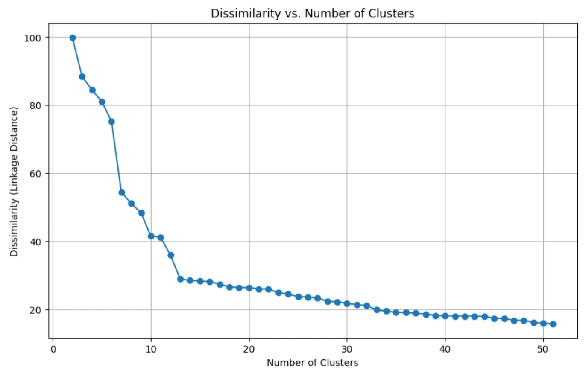
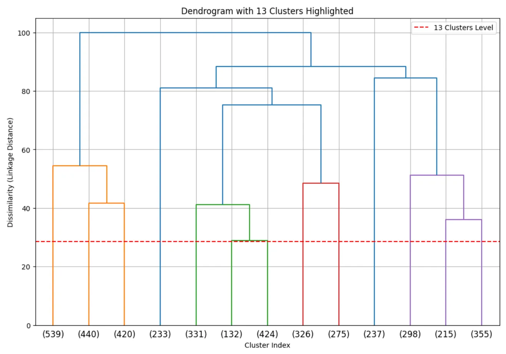
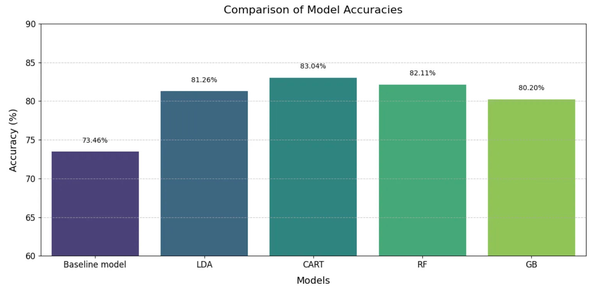
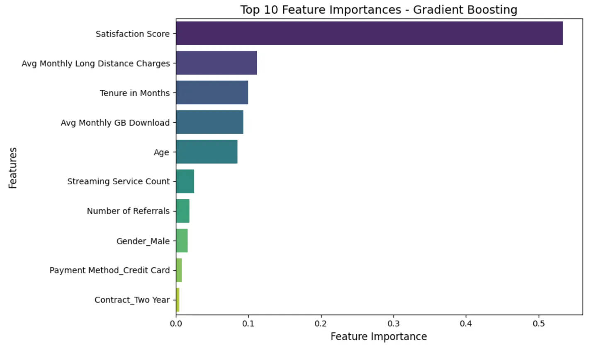

# Cluster-Driven Customer Retention Initiative

## Overview
An innovative machine learning approach to customer churn prediction in the telecommunications industry, combining hierarchical clustering with multi-model classification to achieve high-accuracy predictions. The project implements a novel two-step methodology that first segments customers into behaviorally similar groups before applying targeted prediction models.

## Key Features
- Two-step prediction approach combining clustering and classification
- Advanced feature engineering and selection
- Multiple model comparison (LDA, CART, Random Forest, Gradient Boosting)
- Cluster-specific model training
- Cross-validation for robust performance evaluation

## Dataset
This project uses the Telco Customer Churn Dataset. The data includes:
- Customer demographics
- Service usage patterns
- Billing information
- Churn status and reasons

## Feature Engineering

### Data Preprocessing
1. Missing Value Treatment
   ```python
   df['Offer'].fillna('No Offer', inplace=True)
   df['Internet Type'].fillna('No Internet', inplace=True)
   ```

2. Categorical Encoding
   - Convert categorical variables to dummy variables
   - Special handling for contract types, gender, and internet service types

3. Feature Selection Process:
   - Correlation analysis to identify redundant features
   - VIF (Variance Inflation Factor) analysis for multicollinearity detection
   - Feature importance ranking using LogisticRegression with L1 regularization

### Key Features Selected
- Age
- Monthly charges
- Tenure
- Service usage metrics
- Contract information
- Payment methods
- Service subscriptions

## Methodology

### 1. Customer Segmentation
- Initial exploration with K-means clustering
- Final implementation using Hierarchical Agglomerative Clustering with Ward's linkage
- Optimal cluster determination through dendrogram analysis
- Resulted in 13 distinct customer segments

#### Cluster Analysis Visualization


*Analysis of optimal number of clusters using dissimilarity measure*


*Hierarchical clustering dendrogram showing 13 distinct customer segments*

### 2. Classification Models
For each cluster, implemented and compared:
1. Linear Discriminant Analysis (LDA)
   - Overall accuracy: 81.26%
   - Best performance in clusters 9 and 12 (>94%)

2. Classification and Regression Trees (CART)
   - Overall accuracy: 83.04%
   - Hyperparameter tuning using GridSearchCV
   - Optimal ccp_alpha selection for each cluster

3. Random Forest
   - Overall accuracy: 82.11%
   - Cross-validation implemented for each cluster
   - Feature importance analysis

4. Gradient Boosting
   - Overall accuracy: 80.20%
   - Cluster-specific model optimization

## Results
- Baseline model accuracy: 73.46%
- Best performing model: CART (83.04%)
- Consistent improvement across all clusters
- Highest cluster-specific accuracy: 96% (Cluster 12)


*Comparison of model accuracies across different algorithms*

## Key Findings
1. Most important features:
   - Satisfaction Score
   - Monthly Long Distance Charges
   - Tenure
   - Monthly GB Download
   - Age


*Top 10 most important features identified by Gradient Boosting model*

2. Cluster-specific insights:
   - Different features drive churn in different segments
   - Varying model performance across clusters
   - Some clusters show consistently higher prediction accuracy

## Dependencies
```
numpy==1.24.3
pandas==2.0.3
scikit-learn==1.3.0
scipy==1.11.2
seaborn==0.12.2
matplotlib==3.7.2
```
